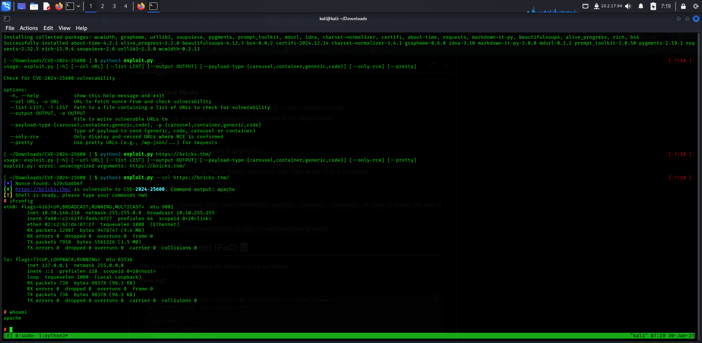
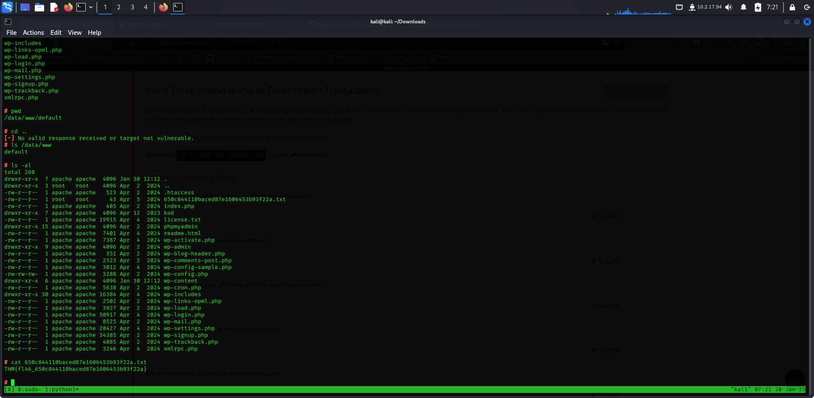
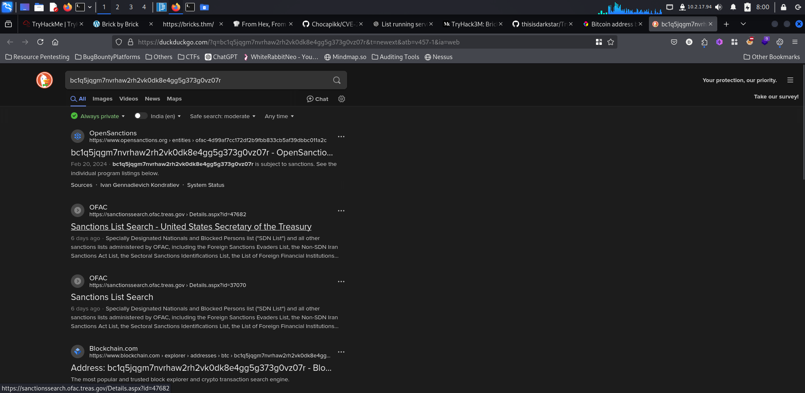

# TryHack3M-Bricks-Heist

**Got the target `10.10.140.218` and host `bricks.thm`**
After navigating to this url `https://bricks.thm` found this page

**viewd source code to find any path or exposed directory**

Figures it's an wordpress site by viewing the src o stylesheet.

**used `wpscan` to get more details about the plugins and themes**
command used: `wpscan --url https://bricks.thm/ --disable-tls-checks`

as we can see the plugin and it's version searched for exploit and found this

**cloned the repo and run the exploit**

**Got the shell**

As per question found this informations :
1. What is the content of the hidden .txt file in the web folder?
commands: `ls -al` then `cat 6**********.txt`

2. What is the name of the suspicious process?
**used command**: `systemctl cat ubuntu.service`

3. What is the service name affiliated with the suspicious process?
**used command**: `systemctl list-units --type=service`

4. What is the log file name of the miner instance?
**used command**: `ls -al /lib/NetworkManager/`

5. What is the wallet address of the miner instance?
we did find the id but it's seem encrypted so lets decrypt

6. The wallet address used has been involved in transactions between wallets belonging to which threat group?

step 1 : navigate to : `https://blockchair.com/` and search up the address.

step 2 : open transaction to see the details

step 3: navigate to privacy section showing issues 

step 4: search each addresses on at a time and see

step 5: read the articles

and here we got the group name LockBit
